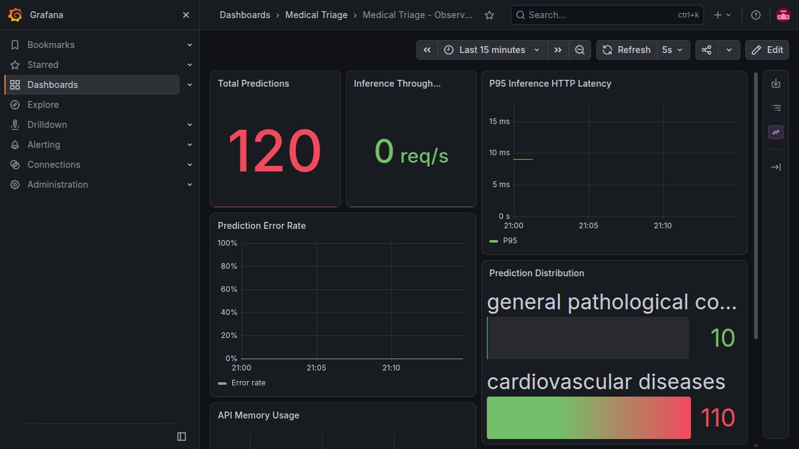
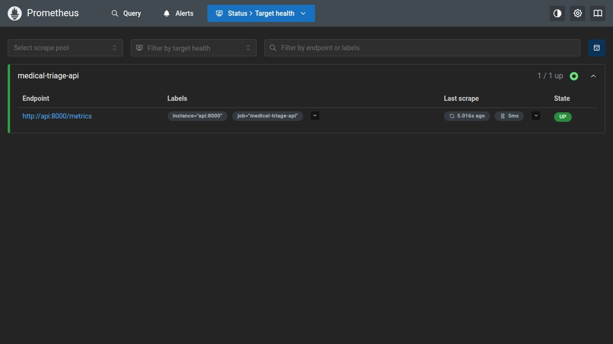
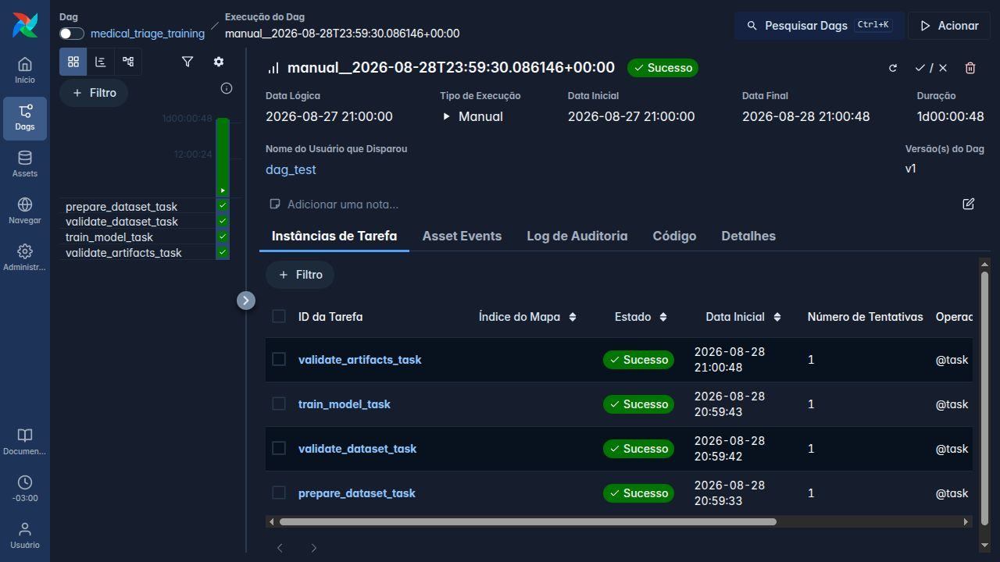

# Medical Triage - MLOps para Classificacao de Textos Medicos

[](https://github.com/RafaExMachina/medical-triage/actions/workflows/ci.yml)
[](https://www.python.org/)
[](https://fastapi.tiangolo.com/)
[](https://airflow.apache.org/)
[](https://onnxruntime.ai/)

API de classificacao de textos medicos com treinamento reproduzivel, serving em
FastAPI, CI no GitHub Actions, orquestracao com Apache Airflow, monitoramento
Prometheus/Grafana e otimizacao de inferencia com ONNX Runtime.

> **Aviso:** projeto academico. O modelo nao e um dispositivo medico e nao deve
> ser usado para diagnostico, priorizacao clinica ou decisao sobre pacientes.

> **Observação de escopo:** O modelo classifica condições médicas, não urgência — essa diferença de escopo permanece.

**Versao:** `0.4.0`  
**Commit auditado:** `b3a63fe5d19b94be8b1fbd429c6eecee15a3a285`  
**Auditoria local:** 28/08/2026  
**Status tecnico:** validado  
**Vídeo STAR:** gravado; falta inserir a URL do YouTube

---

## Sumario

1. [Resumo executivo](#1-resumo-executivo)
2. [Matriz de conformidade](#2-matriz-de-conformidade)
3. [Arquitetura](#3-arquitetura)
4. [Quick start](#4-quick-start)
5. [Quick audit](#5-quick-audit)
6. [Resultados](#6-resultados)
7. [Limitacoes](#7-limitacoes)
8. [Video STAR](#8-video-star)
9. [Documentacao complementar](#9-documentacao-complementar)
10. [Troubleshooting](#10-troubleshooting)

---

## 1. Resumo executivo

### 1.1 Objetivo

O projeto demonstra o ciclo de vida de um modelo leve de NLP em um cenario de
MLOps. A solucao cobre:

- preparacao automatica do dataset;
- treinamento de um classificador de textos;
- persistencia de modelo e metricas;
- API REST com FastAPI;
- empacotamento em Docker;
- testes unitarios e de integracao;
- verificacao de estilo e tipagem;
- CI com GitHub Actions;
- orquestracao de retreino com Airflow;
- metricas Prometheus;
- dashboard Grafana provisionado;
- conversao e serving com ONNX Runtime;
- comparacao de latencia entre sklearn e ONNX;
- documentacao de arquitetura, riscos e limitacoes.

### 1.2 Escopo implementado

O modelo usa TF-IDF e Logistic Regression para classificar resumos medicos em
cinco categorias do Medical Abstracts TC Corpus:

1. `neoplasms`;
2. `digestive system diseases`;
3. `nervous system diseases`;
4. `cardiovascular diseases`;
5. `general pathological conditions`.

O backend ONNX e o padrao de producao. O backend sklearn permanece disponivel
para reproducao do baseline e comparacao de desempenho.

### 1.3 Resultado da auditoria

Foram confirmados:

- `21/21` testes aprovados;
- Ruff format aprovado;
- Ruff lint aprovado;
- Mypy strict aprovado;
- pre-commit aprovado;
- imagem Docker da API construida;
- API em container saudavel;
- Prometheus coletando o target da API;
- Grafana com seis paineis provisionados;
- imagem Airflow construida;
- DAG carregada sem erros de importacao;
- quatro tarefas da DAG concluidas;
- treinamento com 11.550 amostras;
- equivalencia hibrida de 100%;
- equivalencia ONNX completa de 98,996%;
- speedup ONNX local de 2,799 vezes.

### 1.4 CI auditada

A execucao mais recente terminou com `success`:

[Abrir execucao da CI](https://github.com/RafaExMachina/medical-triage/actions/runs/33212699400)

---

## 2. Matriz de conformidade

| Requisito | Implementacao | Evidencia | Status |
|---|---|---|---|
| API FastAPI | `POST /predict` | `src/medical_triage/presentation/api/` | OK |
| Classificador NLP | TF-IDF + Logistic Regression | `src/medical_triage/training/train.py` | OK |
| Dockerfile funcional | Build multi-stage | `Dockerfile` | OK |
| Baseline de latencia | Medicao HTTP | `scripts/measure_latency.py` | OK |
| Decisao de cloud | AWS ECR + EC2 | `docs/stage1-cloud-architecture.md` | OK |
| Testes | 21 testes | `tests/` | OK |
| Formatacao e lint | Ruff | `pyproject.toml` | OK |
| Tipagem | Mypy strict | `pyproject.toml` | OK |
| CI | Quality + Tests | `.github/workflows/ci.yml` | OK |
| DAG Airflow | Quatro tarefas | `airflow/dags/medical_triage_training.py` | OK |
| Ingestao | Preparacao e validacao | `prepare_dataset_task` | OK |
| Treinamento | Treino e persistencia | `train_model_task` | OK |
| Validacao | Modelo e metricas | `validate_artifacts_task` | OK |
| Prometheus | Chamadas e latencia | `src/medical_triage/observability/` | OK |
| Docker Compose | API + Prometheus + Grafana | `docker-compose.yml` | OK |
| Grafana | Seis paineis | `monitoring/grafana/dashboards/` | OK |
| Otimizacao | ONNX Runtime | `scripts/export_onnx.py` | OK |
| Benchmark | sklearn versus ONNX | `reports/` | OK |
| Dataset >= 2.000 | 11.550 treino, 2.888 teste | Medical Abstracts TC | OK |
| Documentacao | README e `docs/` | Documentos por etapa | OK |
| Commits semanticos | Maioria por tipo/etapa | Historico Git | Parcial |
| Vídeo STAR | Gravado, conforme informado pelo autor | Seção 8 | URL a inserir |
| Urgencia clinica | Dataset classifica condicoes | Secao 7 | Parcial |

Legenda:

- **OK:** implementado e reproduzido;
- **Parcial:** ha diferenca em relacao ao enunciado;
- **Pendente:** entregavel ainda nao publicado.
- **URL a inserir:** vídeo gravado; link público ainda não disponibilizado para verificação.

### 2.1 Evidencias visuais

#### Dashboard Grafana



O dashboard apresentou total de predicoes, throughput, P95, taxa de erro,
distribuicao das predicoes e memoria da API.

#### Target Prometheus



O target `medical-triage-api` permaneceu no estado `UP` e coletou
`http://api:8000/metrics`.

#### DAG Airflow



Tarefas concluidas:

- `prepare_dataset_task`;
- `validate_dataset_task`;
- `train_model_task`;
- `validate_artifacts_task`.

---

## 3. Arquitetura

### 3.1 Visao geral

```text
GitHub -> GitHub Actions -> format | lint | mypy | tests

Cliente HTTP
     |
     v
 FastAPI -----------------------> /metrics
     |                                |
     v                                v
ClassifyMedicalTextUseCase       Prometheus
     |                                |
     v                                v
ClassifierPort                      Grafana
     |
     +-------------------+
     |                   |
     v                   v
ONNX Runtime          scikit-learn
padrao                baseline

Apache Airflow
     |
     v
preparar -> validar -> treinar -> validar artefatos
```

### 3.2 Camadas

| Camada | Responsabilidade |
|---|---|
| `domain` | Entidades e contratos |
| `application` | Caso de uso |
| `infrastructure` | Adaptadores sklearn e ONNX |
| `presentation` | FastAPI, rotas e schemas |
| `observability` | Metricas e middleware |
| `data` | Download e preparacao |
| `training` | Treino, avaliacao e persistencia |

### 3.3 Fluxo de inferencia

1. Cliente envia texto para `POST /predict`.
2. Pydantic valida a entrada.
3. FastAPI resolve o caso de uso.
4. O caso de uso chama `ClassifierPort`.
5. O adaptador ONNX executa a inferencia.
6. A API devolve classe, confianca, versao e latencia.
7. O middleware registra metricas.

### 3.4 Fluxo de treinamento

1. Baixar arquivos ausentes.
2. Validar dataset e classes.
3. Separar treino e validacao.
4. Ajustar TF-IDF e Logistic Regression.
5. Calcular accuracy e macro-F1.
6. Salvar modelo e metricas.
7. Exportar ONNX.
8. Validar equivalencia.
9. Executar benchmarks.

### 3.5 Deploy teorico

O cenario usa serving real-time com:

- Amazon ECR para imagens;
- Amazon EC2 para containers;
- Application Load Balancer;
- CloudWatch para infraestrutura;
- Prometheus e Grafana;
- GitHub Actions para CI.

Detalhes: [`docs/stage1-cloud-architecture.md`](docs/stage1-cloud-architecture.md).

---

## 4. Quick start

### 4.1 Pre-requisitos

- Git;
- Python 3.12;
- `uv`;
- Docker Engine;
- Docker Compose;
- internet no primeiro uso.

### 4.2 Clonar e instalar

```bash
git clone https://github.com/RafaExMachina/medical-triage.git
cd medical-triage
uv sync --locked
```

### 4.3 API local

```bash
uv run uvicorn \
  medical_triage.presentation.api.main:app \
  --host 127.0.0.1 \
  --port 8000
```

URLs:

- API: `http://localhost:8000`;
- Swagger: `http://localhost:8000/docs`;
- metricas: `http://localhost:8000/metrics`.

Health check:

```bash
curl http://localhost:8000/health
```

Predicao:

```bash
curl -X POST http://localhost:8000/predict \
  -H "Content-Type: application/json" \
  -d '{"text":"Patient presents with acute chest pain and dyspnea."}'
```

Resposta esperada:

```json
{
  "label_id": 5,
  "label_name": "general pathological conditions",
  "confidence": 0.419,
  "model_version": "tfidf-logreg-v1",
  "inference_ms": 0.8
}
```

### 4.4 Stack de observabilidade

```bash
docker compose up -d --build
docker compose ps
```

| Servico | URL | Credenciais |
|---|---|---|
| FastAPI | `http://localhost:8000/docs` | nenhuma |
| Prometheus | `http://localhost:9090` | nenhuma |
| Grafana | `http://localhost:3000` | `admin` / `admin` |

Validar:

```bash
curl http://localhost:8000/health
curl http://localhost:9090/-/healthy
curl http://localhost:3000/api/health
```

Encerrar:

```bash
docker compose down
```

### 4.5 Airflow

No Linux, informe o UID para permitir escrita nos logs:

```bash
AIRFLOW_UID=$(id -u) docker compose \
  -f airflow/docker-compose.yml \
  up -d --build
```

Interface: `http://localhost:8081`.

Obter senha temporaria:

```bash
AIRFLOW_UID=$(id -u) docker compose \
  -f airflow/docker-compose.yml \
  logs airflow | grep "Password for user"
```

Listar DAGs:

```bash
AIRFLOW_UID=$(id -u) docker compose \
  -f airflow/docker-compose.yml \
  exec airflow airflow dags list --local
```

Executar a DAG:

```bash
AIRFLOW_UID=$(id -u) docker compose \
  -f airflow/docker-compose.yml \
  exec airflow \
  airflow dags test medical_triage_training 2026-08-28
```

---

## 5. Quick audit

### 5.1 Qualidade

```bash
uv sync --locked
uv run pytest -v
uv run ruff format --check .
uv run ruff check .
uv run mypy src
uv run pre-commit run --all-files
```

Resultado auditado:

```text
21 passed
46 files already formatted
All checks passed!
Success: no issues found in 24 source files
```

### 5.2 Treinamento

```bash
uv run python -m medical_triage.training.train
```

Esse comando:

- prepara o dataset;
- carrega 11.550 exemplos;
- treina o pipeline;
- calcula metricas;
- salva `models/classifier.joblib`;
- salva `models/metrics.json`.

### 5.3 Validacao ONNX

Execute nesta ordem:

```bash
uv run python -m medical_triage.training.train
uv run python scripts/export_onnx.py
uv run python scripts/export_onnx_classifier.py
uv run python scripts/validate_onnx_hybrid.py
uv run python scripts/validate_onnx_equivalence.py
uv run python scripts/benchmark_inference_backends.py \
  --runs 1000 \
  --warmup 50
```

> `validate_onnx_hybrid.py` depende do artefato gerado por
> `export_onnx_classifier.py`.

> `export_onnx.py` regenera o pipeline ONNX completo a partir do baseline recém-treinado.
> Execute-o antes de `validate_onnx_equivalence.py` para validar os novos artefatos,
> em vez de comparar apenas com o modelo ONNX já versionado.

### 5.4 Docker

```bash
docker build -t medical-triage:0.4.0 .
docker run --rm -p 8000:8000 medical-triage:0.4.0
```

Em outro terminal:

```bash
curl --fail http://localhost:8000/health
curl --fail http://localhost:8000/metrics
```

### 5.5 Monitoramento

```bash
docker compose up -d --build
docker compose ps
```

Gere requisicoes para `/predict`, aguarde um intervalo de scrape e confirme:

```bash
curl http://localhost:9090/api/v1/targets
```

Consulta PromQL pela API:

```bash
curl --get http://localhost:9090/api/v1/query \
  --data-urlencode 'query=sum(medical_triage_predictions_total)'
```

### 5.6 Airflow

```bash
AIRFLOW_UID=$(id -u) docker compose \
  -f airflow/docker-compose.yml \
  up -d --build
```

```bash
AIRFLOW_UID=$(id -u) docker compose \
  -f airflow/docker-compose.yml \
  exec airflow \
  airflow dags list-import-errors --local
```

Saida esperada:

```text
No data found
```

```bash
AIRFLOW_UID=$(id -u) docker compose \
  -f airflow/docker-compose.yml \
  exec airflow \
  airflow dags test medical_triage_training 2026-08-28
```

Resultado esperado:

```text
prepare_dataset_task       success
validate_dataset_task      success
train_model_task           success
validate_artifacts_task    success
DagRun                     success
```

### 5.7 CI

- [Workflow CI](https://github.com/RafaExMachina/medical-triage/actions/workflows/ci.yml)
- [Execucao auditada](https://github.com/RafaExMachina/medical-triage/actions/runs/33212699400)

---

## 6. Resultados

### 6.1 Modelo

| Metrica | Resultado |
|---|---:|
| Amostras de treino | 11.550 |
| Ajuste | 10.395 |
| Validacao | 1.155 |
| Classes | 5 |
| Accuracy | 0,5931 |
| Macro-F1 | 0,5908 |

Conjunto oficial de teste:

| Backend | Accuracy | Macro-F1 |
|---|---:|---:|
| sklearn | 0,583102 | 0,585593 |
| ONNX completo | 0,585873 | 0,587332 |

### 6.2 Equivalencia

| Item | ONNX completo | Hibrido |
|---|---:|---:|
| Exemplos | 2.888 | 2.888 |
| Predicoes iguais | 2.859 | 2.888 |
| Diferentes | 29 | 0 |
| Concordancia | 98,995845% | 100% |

### 6.3 Latencia auditada

100 execucoes e 10 warmups:

| Backend | Media | P50 | P95 | Req/s |
|---|---:|---:|---:|---:|
| sklearn | 2,2838 ms | 1,9781 ms | 3,7496 ms | 437,86 |
| hibrido | 1,8730 ms | 1,8433 ms | 2,3197 ms | 533,90 |
| ONNX completo | 0,8161 ms | 0,8039 ms | 0,9859 ms | 1.225,37 |

Speedup ONNX completo:

```text
2,799 vezes
```

### 6.4 Relatorios versionados

| Comparacao | Resultado |
|---|---:|
| Reducao media isolada | 53,44% |
| Reducao P95 isolada | 56,39% |
| Reducao do artefato | 31,49% |
| Reducao HTTP media | 34,42% |
| Reducao interna da API | 79,55% |

As metricas medem camadas diferentes:

| Benchmark | Inclui |
|---|---|
| Isolado | Transformacao e modelo |
| `inference_ms` | Inferencia dentro da API |
| HTTP | Rede local, serializacao, middleware e modelo |

### 6.5 Observabilidade

Metricas:

- `medical_triage_http_requests_total`;
- `medical_triage_http_request_duration_seconds`;
- `medical_triage_predictions_total`.

Paineis:

1. Total Predictions;
2. Inference Throughput;
3. P95 Inference HTTP Latency;
4. Prediction Error Rate;
5. Prediction Distribution;
6. API Memory Usage.

---

## 7. Limitacoes

### 7.1 Nao classifica urgencia

> O modelo classifica condições médicas, não urgência — essa diferença de escopo permanece.

O desafio descreve `normal / atencao / urgente`. O dataset escolhido classifica
categorias de condicoes medicas.

Portanto:

- a infraestrutura atende ao objetivo de MLOps;
- o modelo demonstra classificacao de textos;
- nao implementa triagem real por urgencia;
- as classes nao devem ser convertidas artificialmente;
- nao deve ser usado clinicamente.

### 7.2 Qualidade

Accuracy e macro-F1 proximos de 59% caracterizam um baseline academico.

Para uso real seriam necessarios:

- dataset rotulado para urgencia;
- avaliacao clinica;
- metricas por classe;
- analise de falsos negativos;
- calibracao;
- validacao externa;
- testes de vies;
- monitoramento de drift;
- governanca regulatoria.

### 7.3 ONNX

O pipeline completo concorda em 98,996% dos exemplos, mas nao reproduz todas as
probabilidades dentro da tolerancia estrita. O hibrido concorda em 100%, mas nem
sempre oferece o mesmo ganho de latencia.

### 7.4 Seguranca

Para dados reais ainda seriam necessarios:

- autenticacao;
- TLS;
- gestao de segredos;
- criptografia em repouso;
- trilha de auditoria;
- retencao e anonimizacao;
- controles LGPD;
- isolamento de rede.

### 7.5 CI

A CI valida qualidade e testes. Melhorias futuras:

- `docker build`;
- scan de vulnerabilidades;
- SBOM;
- registry;
- deploy de homologacao;
- smoke test pos-deploy.

### 7.6 Airflow

O modo standalone e adequado apenas para demonstracao. No Linux, use sempre
`AIRFLOW_UID=$(id -u)` para permitir escrita nos logs.

---

## 8. Video STAR

**Status:** gravado, conforme informado pelo autor.  
**Publicação:** falta apenas inserir a URL do YouTube no link abaixo.

[Assistir ao vídeo STAR no YouTube](ADICIONAR_URL_DO_YOUTUBE_AQUI)

A gravação foi informada pelo autor; conteúdo e duração não foram verificados nesta auditoria.

Duração máxima exigida pelo enunciado: cinco minutos.

### Situation

- necessidade de operar um classificador com baixa latencia;
- importancia de serving reproduzivel;
- limitacao do dataset academico.

### Task

- API e Docker;
- CI e testes;
- Airflow;
- monitoramento;
- ONNX;
- benchmark.

### Action

- TF-IDF + Logistic Regression;
- FastAPI;
- GitHub Actions;
- quatro tarefas Airflow;
- Prometheus e Grafana;
- conversao ONNX;
- documentacao e Model Card.

### Result

- 21 testes;
- CI `success`;
- stack Docker funcional;
- Prometheus `UP`;
- seis paineis;
- DAG concluida;
- speedup ONNX demonstrado.

### Roteiro

| Tempo | Conteudo |
|---|---|
| 0:00-0:40 | Problema e escopo |
| 0:40-1:20 | Arquitetura e API |
| 1:20-2:00 | CI e testes |
| 2:00-2:40 | Airflow |
| 2:40-3:30 | Prometheus e Grafana |
| 3:30-4:20 | ONNX e latencia |
| 4:20-5:00 | Resultados e limitacoes |

---

## 9. Documentacao complementar

| Documento | Conteudo |
|---|---|
| [`docs/stage1-cloud-architecture.md`](docs/stage1-cloud-architecture.md) | Cloud, API, Docker e baseline |
| [`docs/stage2-ci-airflow.md`](docs/stage2-ci-airflow.md) | CI e Airflow |
| [`docs/observability-plan.md`](docs/observability-plan.md) | Metricas, PromQL e paineis |
| [`docs/stage4-onnx-optimization.md`](docs/stage4-onnx-optimization.md) | ONNX e benchmarks |
| [`docs/model-card.md`](docs/model-card.md) | Uso, qualidade, riscos e limites |

### 9.1 Artefatos

| Artefato | Local |
|---|---|
| Workflow | `.github/workflows/ci.yml` |
| Dockerfile | `Dockerfile` |
| Compose | `docker-compose.yml` |
| Airflow Compose | `airflow/docker-compose.yml` |
| DAG | `airflow/dags/medical_triage_training.py` |
| Prometheus | `monitoring/prometheus/prometheus.yml` |
| Dashboard | `monitoring/grafana/dashboards/medical-triage.json` |
| ONNX | `models/classifier.onnx` |
| Relatorios | `reports/` |

### 9.2 Estrutura

```text
medical-triage/
|-- .github/workflows/ci.yml
|-- airflow/
|-- docs/
|   |-- evidence/
|   |-- model-card.md
|   |-- observability-plan.md
|   |-- stage1-cloud-architecture.md
|   |-- stage2-ci-airflow.md
|   `-- stage4-onnx-optimization.md
|-- models/
|-- monitoring/
|-- reports/
|-- scripts/
|-- src/medical_triage/
|-- tests/
|-- Dockerfile
|-- docker-compose.yml
|-- pyproject.toml
|-- uv.lock
`-- README.md
```

---

## 10. Troubleshooting

| Sintoma | Verificacao ou solucao |
|---|---|
| Docker indisponivel | Execute `docker version` e `docker info` |
| Porta ocupada | Confira `docker ps --format 'table {{.Names}}\t{{.Ports}}'` |
| Airflow sem permissao | Inicie com `AIRFLOW_UID=$(id -u)` |
| DAG ausente | Rode `airflow dags list --local` dentro do container |
| Erro de importacao | Rode `airflow dags list-import-errors --local` |
| Dataset ausente | Execute `uv run python -m medical_triage.data.dataset_loader` |
| `classifier_head.onnx` ausente | Execute `uv run python scripts/export_onnx_classifier.py` |
| Locale ONNX | Confira `docker compose exec api locale` |
| Prometheus DOWN | Valide `/health`, `/metrics` e os logs dos containers |
| Grafana sem dados | Gere trafego, aguarde o scrape e ajuste a janela de tempo |
| Dependencias inconsistentes | Execute `uv sync --locked` e `uv run pytest -v` |

Permissao correta para o Airflow:

```bash
AIRFLOW_UID=$(id -u) docker compose \
  -f airflow/docker-compose.yml \
  up -d --build
```

Diagnostico da DAG:

```bash
AIRFLOW_UID=$(id -u) docker compose \
  -f airflow/docker-compose.yml \
  exec airflow airflow dags list-import-errors --local
```

Encerrar as duas stacks:

```bash
docker compose down
AIRFLOW_UID=$(id -u) docker compose -f airflow/docker-compose.yml down
```

---

## Responsabilidade

Este repositorio tem finalidade educacional. Consulte o
[`Model Card`](docs/model-card.md) para uso pretendido, riscos, dados e
desempenho.
